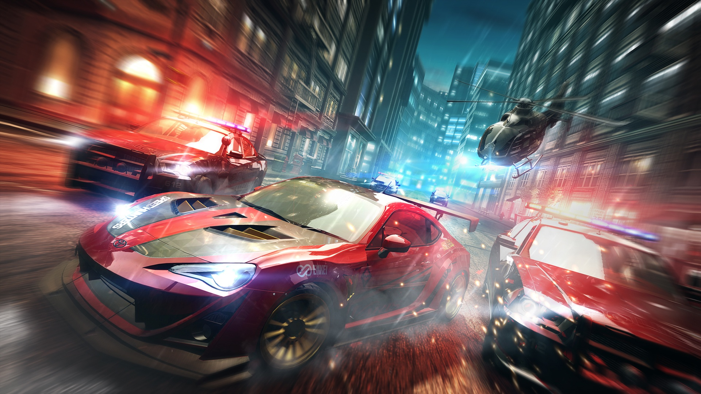

# Don't Crash : Just stop with style

### Problem Statement
The goal of this project is to build an agent to perform autonomous driving in a simulated environment. Autonomous driving is an important area of research as it can make roads safer  by helping to reduce the number of avoidable accidents caused by human error in driving. It can also allow those with disabilities or senior citizens to be able to travel independently and safely. Simulation is a key to self-driving research, because we can test customized situations without facing real-world consequences. For our project, we have been using AirSim, a simulation environment created for autonomous driving research. We would like to test various objectives, such as longest distance without crashing, longest time without crashing, smooth driving, speed, interacting with moving pedestrians, cars. We want to build on AirSim’s framework by employing Computer Vision algorithms for perception and training a Reinforcement Learning agent to perceive and act in our simulation. Furthermore, we wish to compare the agent’s performance when trained on Reinforcement learning and Imitation learning.

#### Demo Video of the Project 
<iframe width="500" height="300" src="https://drive.google.com/file/d/1rzgIjldaCTjWNn65jxPnQ5xmIMGM65DF/preview" frameborder="0" allow="accelerometer; autoplay; encrypted-media; gyroscope; picture-in-picture" allowfullscreen></iframe>

#### Team:
* [Abhilash Karpurapu](https://www.linkedin.com/in/abhilash-karpurapu-5b7275131/)
* [Abhivineet Veeraghanta](https://www.linkedin.com/in/abhivineet/)
* [Haripriya Dharmala](https://www.linkedin.com/in/haripriya-dharmala/)
* [Jaimin Patel](https://www.linkedin.com/in/jaimindpatel/)
* [Naga Sanketh Vysyaraju](https://www.linkedin.com/in/naga-sanketh-vysyaraju/)
* [Shreya Kunchakuri](https://www.linkedin.com/in/shreya-kunchakuri-743662125/)

